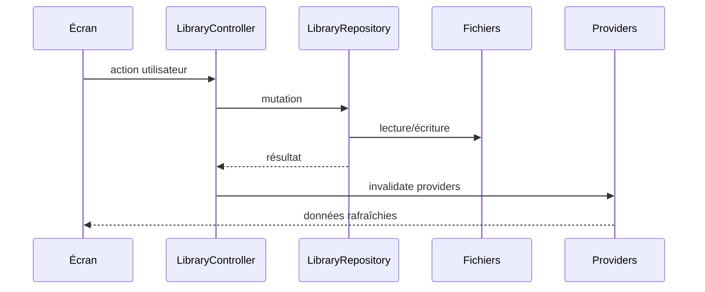

# Données Et État

[← Documentation développeur](../README.md)

## Source de vérité

La source de vérité est le dossier de travail de l'utilisateur.

Les contenus sont de vrais fichiers:

- notes `.md`;
- images;
- vidéos;
- tableaux JSON compatibles;
- dossiers.

Les métadonnées sont stockées dans:

```text
<workspace>/.clipboard/metadata.json
<workspace>/.clipboard/trash.json
<workspace>/.clipboard/trash/
```

## Services et repository

| Élément | Rôle |
| --- | --- |
| [WorkspaceService](../../../lib/core/services/workspace_service.dart) | Persiste et valide le dossier de travail. |
| [SettingsService](../../../lib/core/services/settings_service.dart) | Persiste les réglages utilisateur. |
| [LibraryRepository](../../../lib/features/library/data/library_repository.dart) | Lit, écrit, importe, renomme, déplace et supprime les fichiers. |
| [MetadataStore](../../../lib/features/library/data/metadata_store.dart) | Stocke favoris, tags et séparateurs de notes. |
| [TrashStore](../../../lib/features/library/data/trash_store.dart) | Stocke l'index de corbeille. |

## État Riverpod

Les principaux providers sont dans:

- [workspace_providers.dart](../../../lib/core/providers/workspace_providers.dart)
- [settings_providers.dart](../../../lib/core/providers/settings_providers.dart)
- [library_providers.dart](../../../lib/features/library/application/library_providers.dart)

## Rafraîchissement des données

Desktop:

- `Directory.watch()` est utilisé quand disponible.

Android/iOS:

- un polling léger toutes les 2 secondes remplace le watcher pour éviter des
  assertions `dart:io` sur certains chemins.

## Flux mutation


