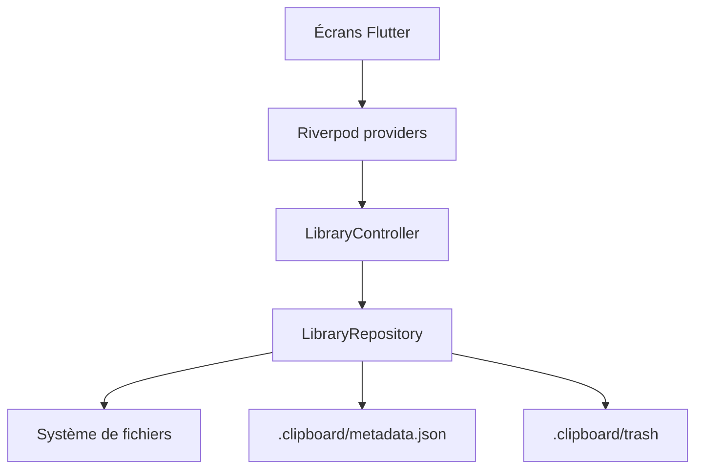

# Architecture

[← Documentation développeur](../README.md)

## Vue globale

Influencor est une application Flutter locale. Le dossier de travail choisi par
l'utilisateur est la source de vérité des contenus. L'application ajoute des
métadonnées dans un dossier caché `.clipboard`.

## Structure des répertoires

| Chemin | Rôle |
| --- | --- |
| [lib/main.dart](../../../lib/main.dart) | Point d'entrée Flutter. |
| [lib/app](../../../lib/app/) | Application, thème, router, shell. |
| [lib/core](../../../lib/core/) | Services partagés, l10n, picker, providers, widgets. |
| [lib/features](../../../lib/features/) | Écrans et logique par fonctionnalité. |
| [lib/shared](../../../lib/shared/) | Énumérations partagées. |
| [test](../../../test/) | Tests Flutter/Dart existants. |
| [android](../../../android/) | Projet Android natif. |
| [windows](../../../windows/) | Projet Windows natif Flutter. |
| [installer](../../../installer/) | Script Inno Setup. |
| [tools](../../../tools/) | Outils auxiliaires du projet. |

## Organisation feature-first

Les fonctionnalités sont organisées par domaine:

- `application`: providers et contrôleurs.
- `data`: accès disque et persistance.
- `domain`: modèles.
- `presentation`: écrans et widgets.

Exemple principal: [lib/features/library](../../../lib/features/library/).

## Frontend / backend

Il n'y a pas de backend applicatif dans le projet. Les données sont lues et
écrites localement.

## Authentification et autorisation

Il n'y a pas d'authentification utilisateur. L'autorisation importante est
l'accès au stockage Android, géré par un MethodChannel natif.

Fichiers liés:

- [storage_permission_service.dart](../../../lib/core/services/storage_permission_service.dart)
- [MainActivity.kt](../../../android/app/src/main/kotlin/com/influencor/app/MainActivity.kt)
