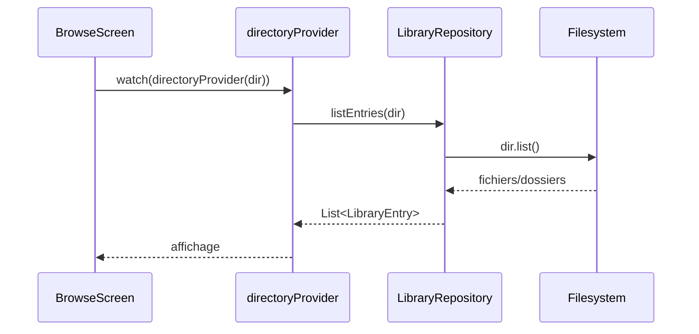

# Flux Bibliothèque

[← Fonctionnalités développeur](./README.md)

## Démarrage

1. `HomeScreen` lit `workspaceControllerProvider`.
2. Si aucun dossier n'est configuré, l'utilisateur choisit un dossier.
3. Si un dossier existe, `BrowseScreen` affiche le contenu.

Fichiers:

- [home_screen.dart](../../../lib/features/home/presentation/home_screen.dart)
- [browse_screen.dart](../../../lib/features/library/presentation/browse_screen.dart)
- [workspace_providers.dart](../../../lib/core/providers/workspace_providers.dart)

## Listing

## Import

`LibraryRepository.importPaths()` copie ou déplace les fichiers. Les fichiers
sont acceptés au moment de l'import, pas lors de la simple navigation.

Cas particulier:

- `.txt` devient `.md`;
- les dossiers sont copiés récursivement;
- les fichiers rejetés sont retournés dans la liste d'échecs.

## Suppression

`moveToTrash()` renomme physiquement l'élément dans `.clipboard/trash/` et ajoute
une entrée dans `.clipboard/trash.json`.
