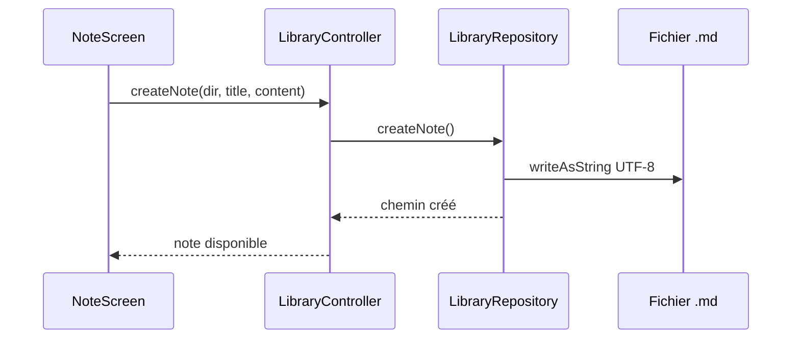

# Flux Notes

[← Fonctionnalités développeur](./README.md)

## Création

## Lecture et sauvegarde

- Lecture: `LibraryController.readNote()` → `LibraryRepository.readTextFile()`.
- Sauvegarde: `LibraryController.saveNote()` → `LibraryRepository.writeTextFile()`.
- Les fichiers texte sont lus et écrits explicitement en UTF-8.

## Images attachées

Les images attachées sont copiées dans un dossier caché `.attachments` à côté
des notes du dossier courant. Les liens sont stockés dans le Markdown de la note.

## Formatage

Le formatage texte est géré par:

- [unicode_styler.dart](../../../lib/core/formatting/unicode_styler.dart)
- [formatting_toolbar.dart](../../../lib/features/library/presentation/widgets/formatting_toolbar.dart)

## Prévisualisation

La prévisualisation de partage est dans:

- [chat_preview_dialog.dart](../../../lib/features/library/presentation/widgets/chat_preview_dialog.dart)
