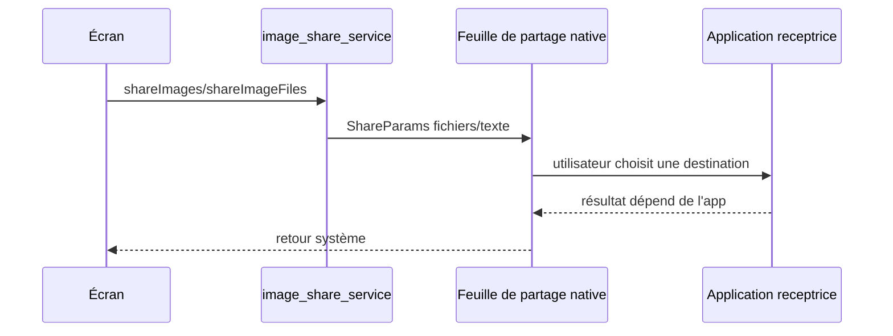

# Flux Partage

[← Fonctionnalités développeur](./README.md)

## Service principal

Le partage image est centralisé dans:

- [image_share_service.dart](../../../lib/core/services/image_share_service.dart)

## Cas supportés

- image seule depuis `PreviewScreen`;
- plusieurs images depuis la sélection de `BrowseScreen`;
- note texte seul ou texte + images depuis `NoteScreen`.

## Flux

## Points importants

- Les images sont partagées avec MIME explicite selon extension.
- Les noms de fichiers sont conservés.
- Le service ne force pas l'application receptrice à ouvrir un mode particulier.
