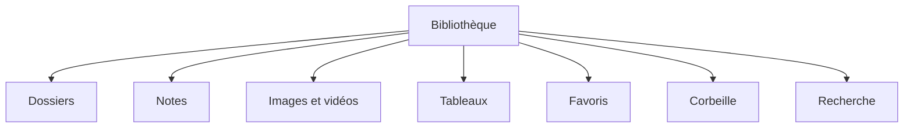

# Fonctionnalités

[← Guide utilisateur](../README.md)

Cette section explique les fonctionnalités principales d'Influencor.

## Sections disponibles

- [Bibliothèque et dossiers](./library.md)
- [Notes](./notes.md)
- [Images, vidéos et partage](./media-and-sharing.md)
- [Tableaux](./tables.md)
- [Recherche, favoris et corbeille](./search-favorites-trash.md)

## Vue d'ensemble

